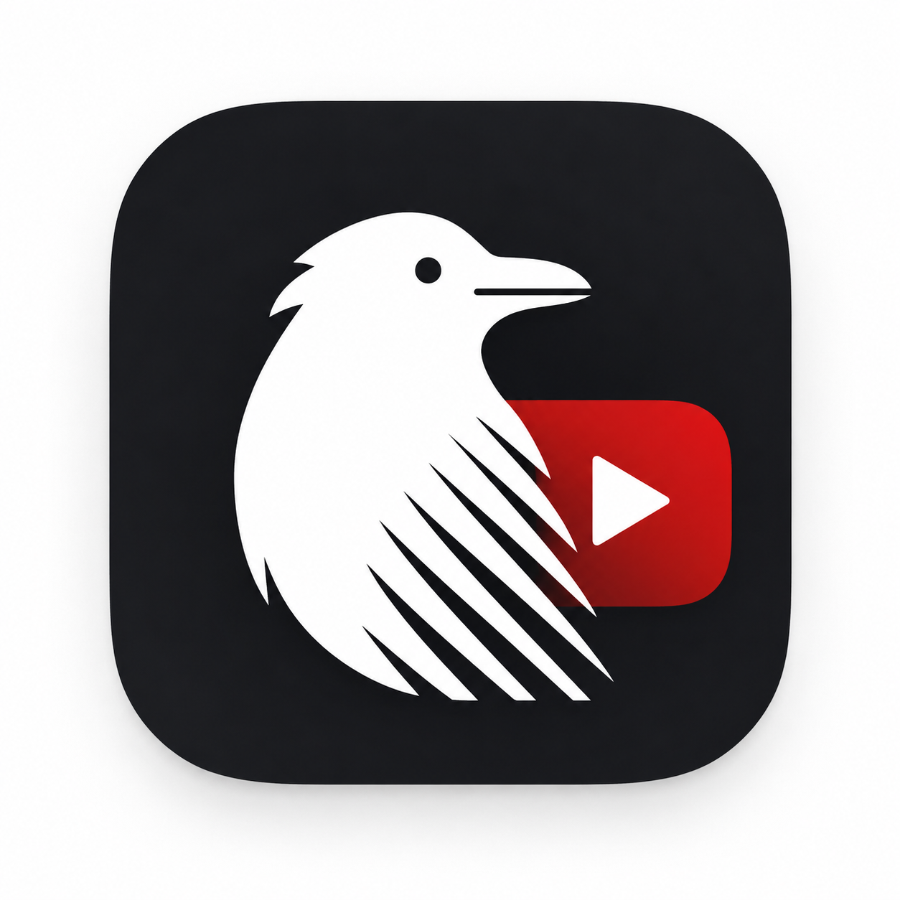
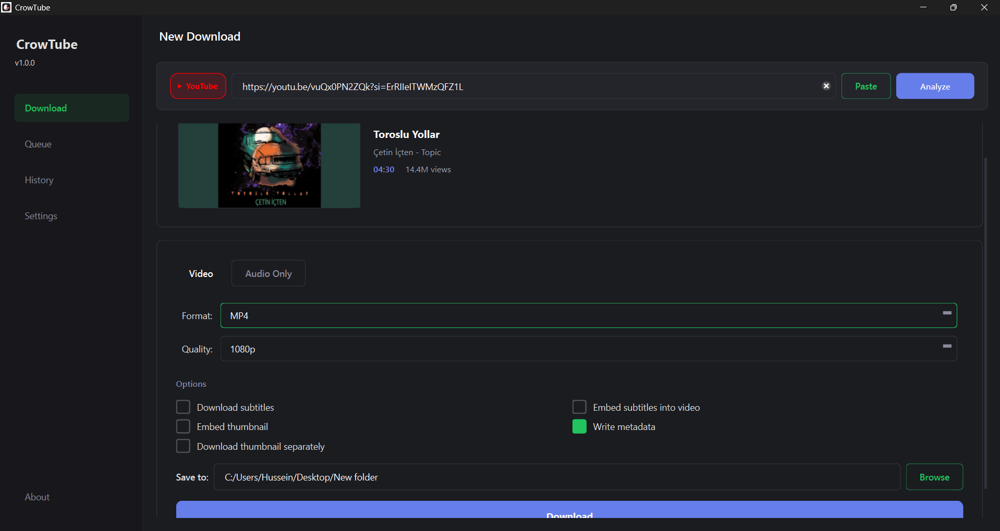
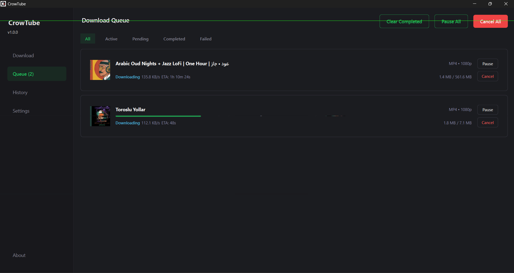
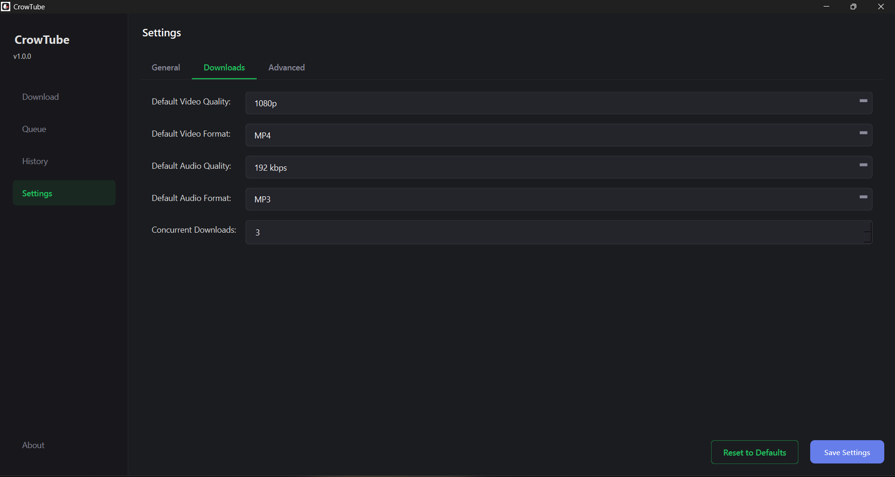

# CrowTube

A modern, open-source YouTube video downloader for Windows — built with **Python**, **PySide6**, **yt-dlp**, and **FFmpeg**.

<p align="center">
  
</p>

---

## Application Info

| Property       | Value                |
|----------------|----------------------|
| **Name**       | CrowTube             |
| **Version**    | 1.0.0                |
| **Author**     | Hussein Al-Fourati   |
| **Organization** | Crow-Dev Team      |
| **Contact**    | hussein.a.habeeb.sec@gmail.com |
| **License**    | MIT                  |

---

## Application Preview

### Main Window

<p align="center">
  
</p>

### Queue Management

<p align="center">
  
</p>

### Settings

<p align="center">
  
</p>

## Download

The latest stable release is available from the Releases page:

https://github.com/Crow-developers/CrowTube/releases/latest

### Quick Start

1. Download the latest release.
2. Extract the archive if required.
3. Run `CrowTube.exe`.
4. Paste a YouTube URL.
5. Select the desired format and quality.
6. Start downloading.


## Features

- **Download YouTube videos** in any quality (360p → 4K)
- **Extract audio** in MP3, M4A, AAC, WAV, or FLAC
- **Download & embed subtitles** automatically
- **Playlist support** — download all or select specific videos
- **Download queue** with concurrent downloads (up to 5)
- **Download history** stored in a local SQLite database
- **Dark & Light themes** with modern UI design
- **Thumbnail previews** with efficient LRU caching
- **Shimmer loading animations** for a smooth user experience
- **Customizable settings** — quality, format, save location, proxy
- **Portable** — builds to a single `.exe` with no installation required

---

## Getting Started (Execution from Source Code)

If you have obtained the source code of CrowTube, follow these steps to set up the development environment and run the application:

### Prerequisites

- **Python 3.10+** — [Download Python](https://www.python.org/downloads/)
- **Git** — [Download Git](https://git-scm.com/downloads)


### 1. Install Python Dependencies

```bash
pip install -r requirements.txt
```

### 2. Download Required Tools (FFmpeg & yt-dlp)

Run the automated setup script to securely download the necessary backend tools into the `tools/` directory:

```cmd
setup_tools.bat
```

### 3. Execute the Application

```cmd
python app.py
```

---

## Build Portable Executable

To build a standalone `.exe` file that can run on any Windows machine without Python:

```cmd
build.bat
```

The compiled file will be at:

```
dist\CrowTube.exe
```

> **Note:** Make sure no instance of `CrowTube.exe` is running before building.

---

## Project Structure

```
CrowTube/
│
├── app.py                    # Application entry point
├── build.bat                 # PyInstaller build script
├── setup_tools.bat           # Downloads yt-dlp & FFmpeg
├── requirements.txt          # Python dependencies
├── README.md
├── LICENSE
│
├── assets/
│   └── icon.png              # App icon
│
├── config/
│   └── constants.py          # App-wide constants & configuration
│
├── downloader/
│   ├── download_engine.py    # yt-dlp wrapper (extract & download)
│   ├── download_queue.py     # Queue manager with concurrency control
│   ├── download_worker.py    # QThread-based background workers
│   └── models.py             # Data models (VideoInfo, DownloadItem, etc.)
│
├── services/
│   ├── history_manager.py    # SQLite history storage
│   ├── settings_manager.py   # QSettings-based INI configuration
│   └── thumbnail_loader.py   # Async thumbnail fetcher with LRU cache
│
├── tools/                    # Auto-downloaded binaries
│   ├── yt-dlp.exe
│   ├── ffmpeg.exe
│   └── ffprobe.exe
│
├── ui/
│   ├── main_window.py        # Main window shell & sidebar
│   ├── dialogs/
│   │   └── about_dialog.py   # About dialog
│   ├── pages/
│   │   ├── download_page.py  # URL input & format selection
│   │   ├── queue_page.py     # Active downloads display
│   │   ├── history_page.py   # Download history
│   │   └── settings_page.py  # App settings
│   ├── widgets/
│   │   ├── animated_button.py
│   │   ├── download_item_widget.py
│   │   ├── format_selector.py
│   │   ├── platform_badge.py
│   │   ├── playlist_selector.py
│   │   ├── shimmer_widget.py
│   │   ├── url_input_bar.py
│   │   └── video_info_card.py
│   └── styles/
│       ├── dark_theme.qss
│       └── theme.py
│
├── data/                     # Runtime data (auto-created)
│   ├── history.db
│   └── settings.ini
│
└── logs/                     # Application logs (auto-created)
    └── app.log
```

---

## Configuration

All settings are stored in `data/settings.ini` and can be changed through the **Settings** page:

| Setting                | Default          | Description                          |
|------------------------|------------------|--------------------------------------|
| Download Folder        | `~/Downloads`    | Where files are saved                |
| Video Quality          | 1080p            | Default video resolution             |
| Audio Quality          | 192 kbps         | Default audio bitrate                |
| Video Format           | MP4              | Default container format             |
| Audio Format           | MP3              | Default audio codec                  |
| Concurrent Downloads   | 3                | Max simultaneous downloads (1-5)     |
| Theme                  | Dark             | UI theme (Dark / Light)              |

---

## Contributing

Contributions are welcome! To contribute:

1. Fork the repository
2. Create a feature branch: `git checkout -b feature/my-feature`
3. Commit your changes: `git commit -m "Add my feature"`
4. Push the branch: `git push origin feature/my-feature`
5. Open a Pull Request

---

## Contact

For questions, suggestions, or bug reports:

- **Email:** hussein.a.habeeb.sec@gmail.com
- **Author:** Hussein Al-Fourati
- **Organization:** Crow-Dev Team

---

##  Open Source License

CrowTube is fully open-source software, freely available for anyone to use, modify, study, and distribute under the terms of the MIT License. You are highly encouraged to review the source code, improve upon it, and contribute back to the community.

**MIT License**

Copyright (c) 2026 Hussein Al-Fourati — Crow-Dev Team

Permission is hereby granted, free of charge, to any person obtaining a copy
of this software and associated documentation files (the "Software"), to deal
in the Software without restriction, including without limitation the rights
to use, copy, modify, merge, publish, distribute, sublicense, and/or sell
copies of the Software, and to permit persons to whom the Software is
furnished to do so, subject to the following conditions:

The above copyright notice and this permission notice shall be included in all
copies or substantial portions of the Software.

THE SOFTWARE IS PROVIDED "AS IS", WITHOUT WARRANTY OF ANY KIND, EXPRESS OR
IMPLIED, INCLUDING BUT NOT LIMITED TO THE WARRANTIES OF MERCHANTABILITY,
FITNESS FOR A PARTICULAR PURPOSE AND NONINFRINGEMENT. IN NO EVENT SHALL THE
AUTHORS OR COPYRIGHT HOLDERS BE LIABLE FOR ANY CLAIM, DAMAGES OR OTHER
LIABILITY, WHETHER IN AN ACTION OF CONTRACT, TORT OR OTHERWISE, ARISING FROM,
OUT OF OR IN CONNECTION WITH THE SOFTWARE OR THE USE OR OTHER DEALINGS IN THE
SOFTWARE.

---

## Acknowledgements

- [yt-dlp](https://github.com/yt-dlp/yt-dlp) — Media extraction engine
- [FFmpeg](https://ffmpeg.org/) — Multimedia processing
- [PySide6](https://doc.qt.io/qtforpython-6/) — Qt for Python UI framework
- [PyInstaller](https://pyinstaller.org/) — Executable packaging